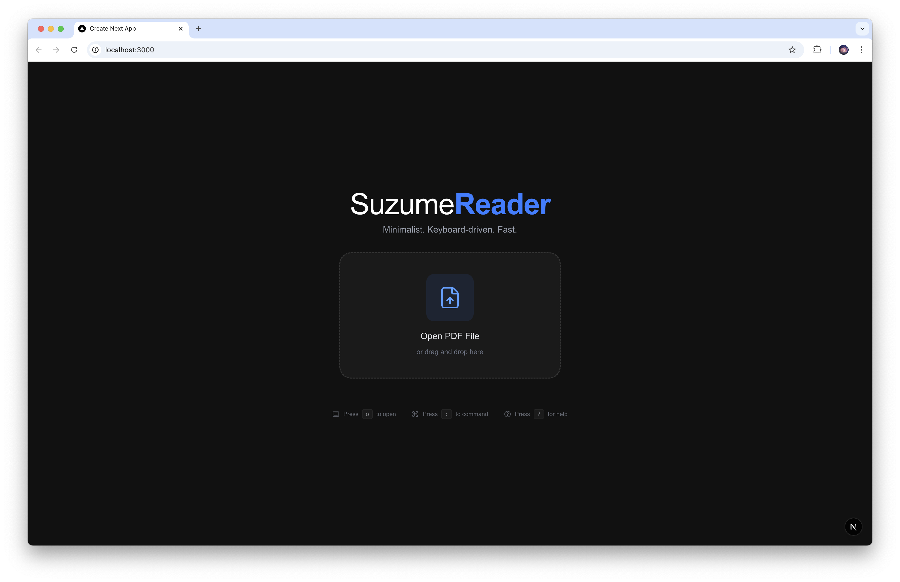
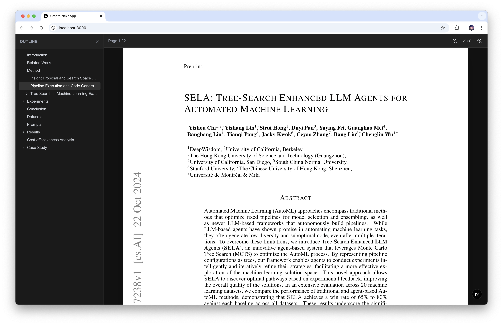
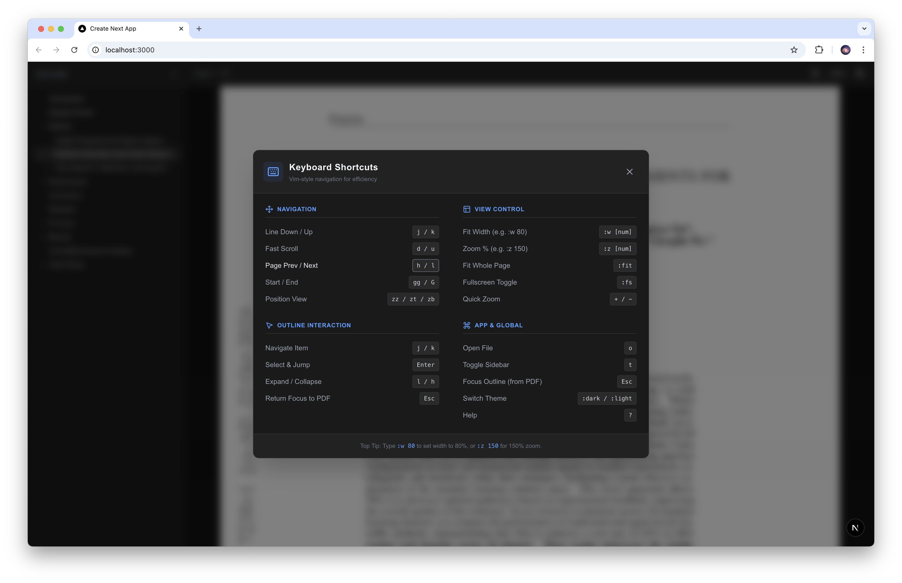

# 🦅 Suzume

**Suzume** is a high-performance, keyboard-centric PDF reader built for speed and efficiency. Inspired by Vim, it offers a mouseless navigation experience, making it ideal for power users who want to fly through documents without leaving the keyboard.

Built with **Next.js 16 (Turbopack)**, **React PDF**, and **Zustand**.

## 📸 Screenshots

### Landing Page


_Clean startup interface_

### PDF Reader


_Distraction-free reading with Vim bindings_

### Help Menu


_Keyboard shortcuts reference_

## ✨ Features

- **Vim-like Navigation**: Navigate documents using `j`, `k`, `d`, `u`, `gg`, `G` and more.
- **Command Mode**: Type `:` to access commands like `:a` (Absolute), `:r` (Relative), and `:dark`.
- **Keyboard-Driven Outline**: Browse the table of contents, expand/collapse sections (`h`/`l`), and jump to chapters (`Enter`) entirely via keyboard.
- **Dark Mode**: Built-in optimized dark mode for comfortable late-night reading.
- **Focus Management**: Toggle focus seamlessly between the PDF content and the Outline sidebar using `Esc`.
- **Performance**: Virtualized list rendering (via `react-window`) ensures buttery smooth scrolling even for massive PDFs.
- **Absolute & Relative Viewing**:
    - `:a [num]` - Absolute zoom level (e.g., `:a 150` for 150%).
    - `:r [num]` - Relative width fitting (e.g., `:r 90` for 90% page width).
    - `:fw` - Fit Width (100% Relative).
    - `:fp` - Fit Page (Calculated Absolute to fit entire page).

## 🚀 Getting Started

### Prerequisites

- Node.js 18+
- npm / yarn / pnpm

### Installation

1.  Clone the repository:

    ```bash
    git clone https://github.com/AbyssSkb/suzume.git
    cd suzume
    ```

2.  Install dependencies:

    ```bash
    npm install
    ```

3.  Run the development server:

    ```bash
    npm run dev
    ```

4.  Open [http://localhost:3000](http://localhost:3000) to start reading.

## ⌨️ Keyboard Shortcuts

Press `?` in the app to view the full help menu.

### Navigation (PDF)

| Key        | Action                    |
| :--------- | :------------------------ |
| `j` / `k`  | Scroll Down / Up          |
| `d` / `u`  | Fast Scroll Down / Up     |
| `h` / `l`  | Previous / Next Page      |
| `ctrl + o` | Jump Back in History      |
| `ctrl + i` | Jump Forward in History   |
| `gg` / `G` | Go to First / Last Page   |
| `zz`       | Center Current Page View  |
| `:[num]`   | Jump to Page (e.g. `:10`) |

| Command            | Description                         |
| :----------------- | :---------------------------------- |
| `a`                | Toggle Absolute / Relative Mode     |
| `:a [num]`         | Set Absolute Zoom % (e.g. `:a 150`) |
| `:r [num]`         | Set Relative Width % (e.g. `:r 90`) |
| `:fw`              | Fit Width (100% Relative)           |
| `:fp`              | Fit Page (Calculated Absolute)      |
| `+` / `-`          | In-mode Zoom In / Out               |
| `:fs`              | Toggle Fullscreen                   |
| `:dark` / `:light` | Switch Theme (Dark / Light)         |

| Key       | Action                             |
| :-------- | :--------------------------------- |
| `t`       | Toggle Sidebar Visibility          |
| `Esc`     | Focus Outline (from PDF)           |
| `j` / `k` | Navigate Outline Items             |
| `l` / `h` | Expand / Collapse Item             |
| `Enter`   | Select & Jump to Chapter           |
| `Esc`     | Return Focus to PDF (from Outline) |

### General

| Key | Action              |
| :-- | :------------------ |
| `o` | Open New File       |
| `r` | Recent Files Finder |
| `?` | Toggle Help Menu    |

## 🛠️ Tech Stack

- **Framework**: [Next.js 16](https://nextjs.org/)
- **PDF Rendering**: [react-pdf](https://github.com/wojtekmaj/react-pdf)
- **Virtualization**: [react-window](https://github.com/bvaughn/react-window)
- **State Management**: [Zustand](https://github.com/pmndrs/zustand)
- **Styling**: [Tailwind CSS](https://tailwindcss.com/)
- **Icons**: [Lucide React](https://lucide.dev/)

## 📄 License

MIT
